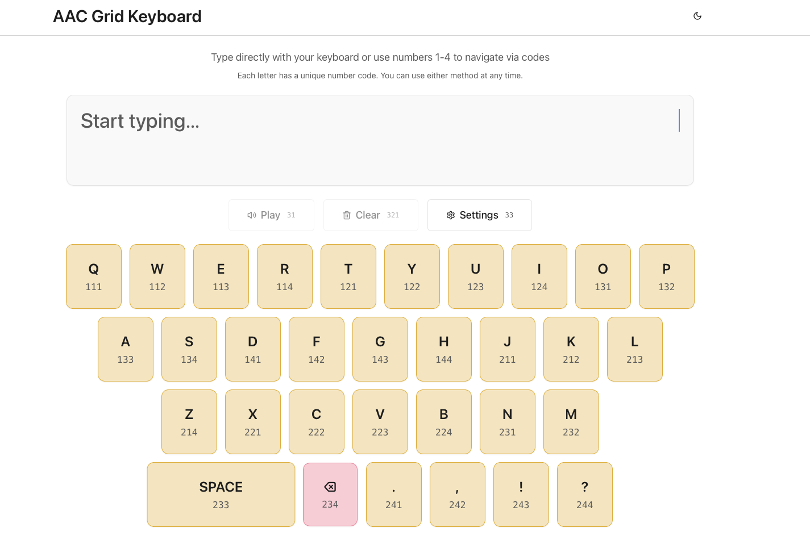

# Description
This is an on-screen keyboard for Augmentative and Alternative Communication device users. The inputs to the keyboard are numbers 1-4 and these are used to select the keboard keys (through huffman coding). There is text to speech with every input. Can be used in combination with various AAC modalities connected via a microcontroller/raspberry-pi HID input.
# Run on Visual Studio Code and open on localhost
1. Open the repository as a folder on VS Code
2. Open the terminal and run 'npm install'
3. Under the server folder, open the index.ts file and at the bottom set your desired port number (default is localhost:3000).
4. run 'npm run dev' on the terminal (as described in .replit file)
5. Type 'localhost:3000' (or your specified port number) on a web browser and you will have the AAC keyboard open.
- Made using Replit

